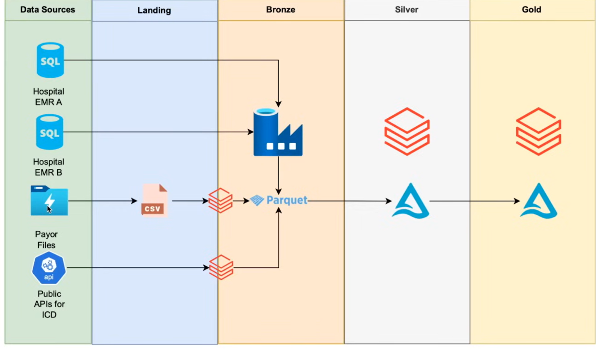
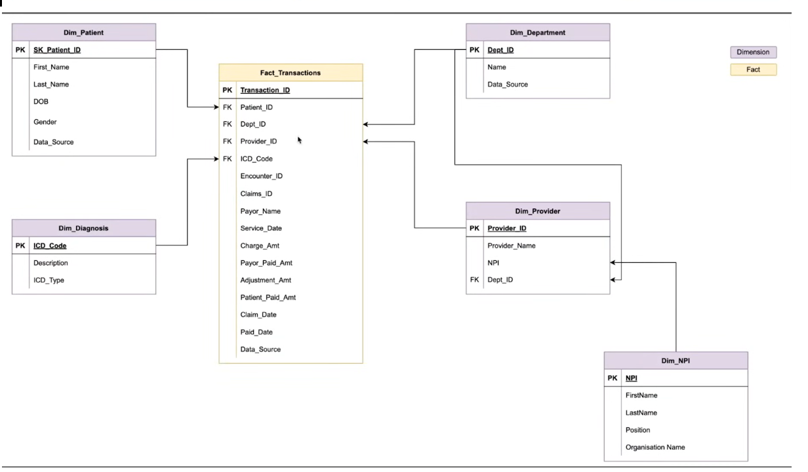

# Healthcare Revenue Cycle Management Data Platform (Azure Data Engineering)

## Project Overview

This project implements an end-to-end Azure Data Engineering pipeline for the Healthcare Revenue Cycle Management (RCM) domain.

Healthcare organizations generate large volumes of data from multiple systems such as Electronic Medical Records (EMR), Insurance Claims, and Public Healthcare APIs. This project builds a scalable Azure-based data platform that ingests, processes, and transforms this data into analytics-ready datasets.

The pipeline follows the Medallion Architecture (Bronze → Silver → Gold) and produces Fact and Dimension tables that support financial analytics such as Accounts Receivable tracking and payment analysis.

---

## Problem Statement

Revenue Cycle Management (RCM) is the financial process used by hospitals to track patient care from appointment scheduling to final payment collection.

The process typically includes:

1. Patient registration and insurance verification  
2. Healthcare services provided by doctors  
3. Billing generated for services  
4. Insurance claim submission and review  
5. Payments received from insurance providers or patients  
6. Financial reporting and monitoring

Hospitals often face challenges such as delayed payments, claim denials, and partial reimbursements. To manage this efficiently, organizations need a reliable data platform capable of integrating operational data and generating financial insights.

This project builds a cloud-based data pipeline that consolidates healthcare data to enable revenue analytics and operational reporting.

---

## Architecture Overview

The solution follows the Medallion Data Architecture to organize data processing into multiple layers.

**Layers**

| Layer | Description |
|------|-------------|
| Landing | Raw ingestion of external datasets |
| Bronze | Raw source-of-truth data stored in Parquet format |
| Silver | Cleaned and standardized data using Delta tables |
| Gold | Business-level aggregated tables for analytics |

Architecture Diagram:



---

## Technology Stack

| Category | Technology |
|---------|------------|
| Cloud Platform | Microsoft Azure |
| Data Ingestion | Azure Data Factory |
| Data Processing | Azure Databricks (PySpark) |
| Storage | Azure Data Lake Storage Gen2 |
| Source Database | Azure SQL Database |
| Data Format | Parquet, Delta Lake |
| Secrets Management | Azure Key Vault |
| Governance | Unity Catalog |

---

## Data Sources

### Electronic Medical Records (EMR)

Stored in Azure SQL Database.

Tables include:

- Patients  
- Providers  
- Departments  
- Encounters  
- Transactions  

Data originates from multiple hospitals.

---

### Insurance Claims Data

Insurance providers deliver claims data periodically in CSV format.

These files are placed in the Data Lake landing zone and processed by the pipeline.

---

### NPI Data (API)

NPI stands for National Provider Identifier, a unique identifier assigned to healthcare providers.

The data is retrieved using public healthcare APIs.

---

### ICD Codes

ICD codes represent standardized medical diagnosis codes used by healthcare providers.

These codes are ingested from public APIs.

---

### CPT Codes

CPT codes represent medical procedures and treatments performed during patient care.

These codes are ingested from flat files.

---

## Data Pipeline Design

Data ingestion is orchestrated using Azure Data Factory with a metadata-driven pipeline design.

Pipeline workflow:

1. Read configuration metadata
2. Identify source systems and tables
3. Extract data from source systems
4. Load raw data into Bronze layer
5. Log ingestion metadata for auditing
6. Trigger transformation jobs in Databricks

Key pipeline features:

- Metadata-driven ingestion  
- Incremental and full load support  
- Audit logging  
- Automated file archiving  
- Parallel pipeline execution  

---

## Data Processing

Data transformations are implemented using Azure Databricks (PySpark).

### Bronze Layer

The Bronze layer stores raw ingested data in Parquet format.

Characteristics:

- Raw source-of-truth data
- Schema preserved from source systems
- Minimal transformation

---

### Silver Layer

The Silver layer performs data cleaning and standardization.

Transformations include:

- Schema normalization
- Data quality validation
- Common Data Model (CDM)
- Slowly Changing Dimension (SCD Type 2)
- Deduplication and filtering

Data is stored as Delta tables for efficient processing.

---

### Gold Layer

The Gold layer contains business-level aggregated datasets used for reporting.

This layer generates Fact and Dimension tables optimized for analytics and BI tools.

---

## Data Model

The analytics layer follows a Star Schema design.

Fact Table:

**Fact_Transactions**

Contains financial transaction metrics including:

- Charge Amount  
- Insurance Payment  
- Patient Payment  
- Adjustment Amount  
- Service Date  
- Claim Date  

Dimension Tables:

- Dim_Patient  
- Dim_Provider  
- Dim_Department  
- Dim_Diagnosis  
- Dim_NPI  

Star Schema Diagram:



---

## Key Features Implemented

- End-to-end Azure Data Engineering pipeline
- Medallion architecture implementation
- Metadata-driven ingestion pipelines
- Incremental and full data load support
- Audit logging for ingestion tracking
- Slowly Changing Dimension Type 2 (SCD2)
- Delta Lake data storage
- Healthcare star schema data model
- Secure credential management using Azure Key Vault

---

## Security

Sensitive credentials such as storage access keys are stored securely in Azure Key Vault.

Databricks retrieves secrets using:

```
dbutils.secrets.get("keyvault-scope", "secret-name")
```

This ensures credentials are not exposed in code or configuration files.

---

## Repository Structure

```
healthcare-rcm-data-engineering
│
├── adf-pipelines
│
├── databricks-notebooks
│   ├── bronze
│   ├── silver
│   └── gold
│
├── configs
│   └── load_config.csv
│
├── architecture
│   ├── architecture-diagram.png
│   └── data-model.png
│
└── README.md
```

---

## Future Improvements

- CI/CD pipeline integration
- Data quality monitoring framework
- Real-time streaming ingestion
- Power BI dashboards for KPI reporting
- Data lineage tracking using Unity Catalog

---

## Note

All datasets used in this project were generated using the Faker library for demonstration purposes. Some joins may produce null values due to limited API sample data.
